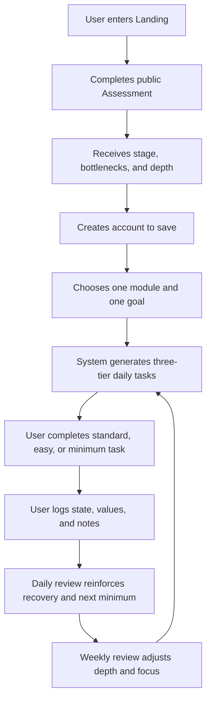
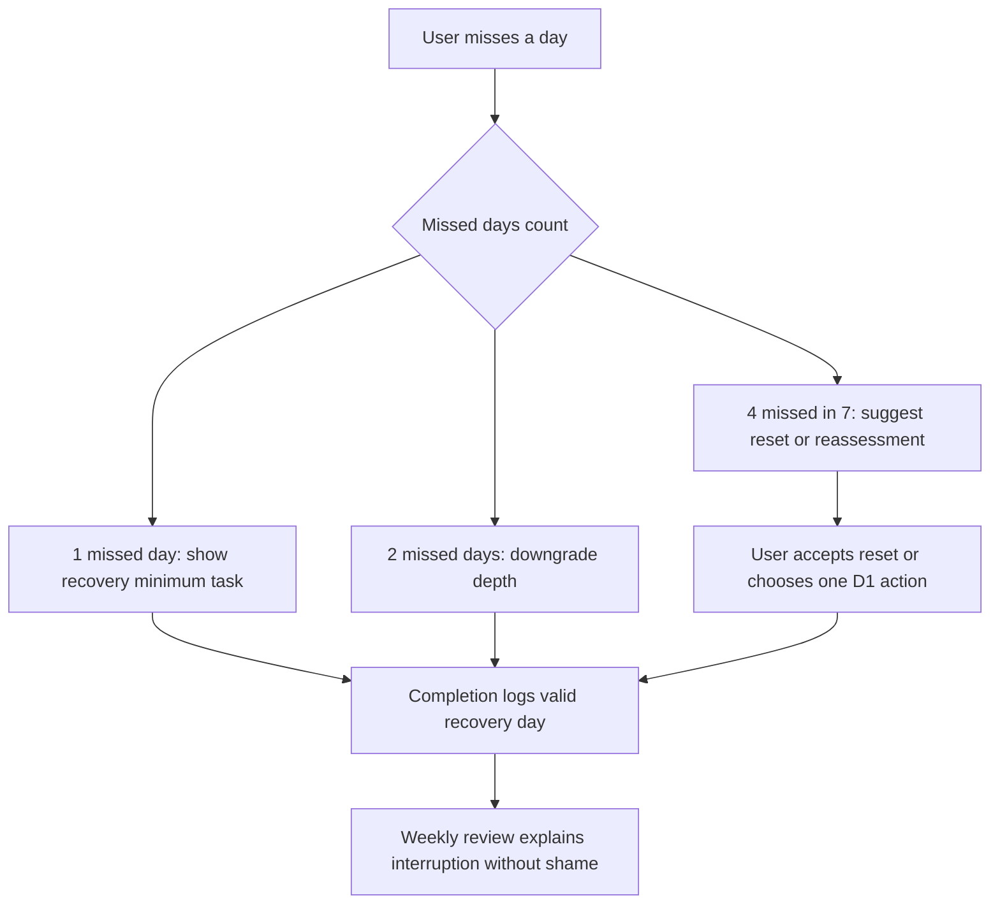

# StayThread PRD Requirements v0.5

Product Requirements Document and Launch Artifact Chain  
American English working draft  
Date: June 2, 2026

## 0. Current Phase Judgment

StayThread is past the idea stage. The existing v0.4 PRD, product plan, engineering spec, backend integration notes, and beta test plan already define the product thesis, MVP direction, first prototype flow, Supabase-backed implementation surface, and early beta criteria.

This v0.5 document turns those inputs into a development-ready product artifact chain:

1. Product One-Pager
2. User scenarios
3. MVP in-scope and out-of-scope boundaries
4. Core product loop
5. User flows, business flows, and state transitions
6. Page list and information architecture
7. PRD feature specifications
8. AI task definitions
9. Prompt templates, input JSON, and output JSON Schemas
10. Data model
11. Low-fidelity prototype and UI design inputs
12. Development task breakdown
13. AI evaluation cases
14. Functional test checklist
15. Launch checklist
16. Analytics and iteration plan

### Confirmed Inputs

- Product: StayThread
- Core positioning: an AI-guided long-term action system
- Target MVP behavior: assessment to prescription to daily three-tier action to review
- Current implementation direction: Next.js App Router, TypeScript, Supabase PostgreSQL, server-side AI calls
- First launch shape: 5 to 10 private beta users over 14 days

### Assumptions To Confirm

- The first public beta should prioritize independent builders, site owners, readers, writers, and gentle movement restarters.
- The MVP should keep AI generation controlled and structured; deterministic rules remain the source of truth for scoring, depth, safety, and category templates.
- The product should use "minimum task" in internal requirements while testing user-facing alternatives such as "keep-alive task."
- The MVP should not include a Chrome extension, wearable integrations, social accountability, or native mobile apps.
- Movement-related copy must stay non-medical and conservative.

## 1. Product One-Pager

| Field | Requirement |
| --- | --- |
| Product name | StayThread |
| One-sentence positioning | StayThread is an AI-guided long-term action system that assesses a user's current action profile, recommends the right training depth, and turns slow-feedback goals into realistic daily actions. |
| Target users | Independent builders, site owners, readers, knowledge workers, writers, learners, and people rebuilding gentle movement habits. |
| Core pain | Users care about long-term goals but lose continuity because the feedback is slow, the next action is ambiguous, and high-stimulation alternatives provide easier reward. |
| Current alternatives | Generic to-do apps, habit trackers, calendars, productivity dashboards, motivational chatbots, focus blockers, and self-discipline content. |
| Product promise | The user does not need a perfect day to keep a long-term goal alive. StayThread gives a realistic action level for today, preserves continuity through minimum tasks, and helps the user recover after interruption. |
| Version 1 only solves | Assessment, training depth, one active goal, category-based daily task generation, three-tier tasks, progress logging, daily review, weekly review, and privacy controls. |
| Version 1 does not solve | Chrome blocking, social accountability, wearable integrations, clinical coaching, mobile apps, complex gamification, or broad project management. |
| Core loop | Assess current state -> generate prescription -> choose one module and goal -> complete standard/easy/minimum task -> log progress -> review -> adjust next action. |
| Key metrics | Assessment completion, result-to-register conversion, Day-1 task completion, minimum task completion, five-of-seven chain rate, recovery within 48 hours, weekly review completion, AI usefulness rating. |
| Commercial hypothesis | A narrow segment of builders and knowledge workers will pay for structured continuity support once the product proves that it reduces restart behavior. |
| Largest risk | Users may understand the assessment but fail to return daily unless the Today page is simpler and more immediately useful than their current routine. |

## 2. User Scenarios

### 2.1 Core Scenarios

| Scenario | User | Trigger | Current problem | Product intervention | Final result | Success signal |
| --- | --- | --- | --- | --- | --- | --- |
| Rebuilding a side project rhythm | Independent builder | User has a product idea or unfinished MVP but keeps restarting | The goal is too large and "work on product" is too vague | Assessment identifies startup or planning bottleneck; project template generates one verifiable action | User completes a small requirement, feature, test, or feedback task | User logs at least one valid action on 5 of 7 days |
| Returning to deep reading | Reader or knowledge worker | User wants to read but defaults to feeds or shallow browsing | Reading feels low-stimulation and hard to start | Reading module starts at D1 or D2 and uses pages, minutes, and notes as process assets | User reads a small amount without pressure and sees accumulated pages/notes | User completes at least 4 reading actions in 7 days |
| Restarting sustainable movement | Gentle movement restarter | User wants energy and physical routine but has low baseline or inconsistent history | Plans are too intense, causing dropout or discomfort | Movement module asks constraints, starts with conservative walking, and downgrades when discomfort appears | User completes movement without shame or overreach | User reports completion with no unsafe escalation |

### 2.2 Failure Scenarios

| Scenario | Failure mode | Required handling |
| --- | --- | --- |
| Assessment abandonment | User leaves before submitting answers | Preserve local progress where possible, keep CTA simple, and allow restart without account creation. |
| AI task too generic | Generated task sounds like generic advice | Fall back to deterministic category template and ask for the missing profile field only if needed. |
| Movement safety risk | User reports pain, injury, or major discomfort | Lower intensity, avoid medical claims, show conservative guidance, and recommend professional advice when appropriate. |

### 2.3 Recovery Scenarios

| Scenario | Trigger | Product response | Success signal |
| --- | --- | --- | --- |
| Missed one day | No valid action yesterday | Use recovery language and offer today's minimum task first | User completes any valid action within 48 hours |
| Two missed days | Consecutive missed days | Downgrade depth and reduce cognitive load | User returns without reassessment unless needed |
| Four missed days in seven | Strong interruption pattern | Suggest reset or reassessment and simplify to one goal | User accepts reset or completes a D1 action |

### 2.4 Main User Path

1. User opens Landing.
2. User starts the free assessment before creating an account.
3. User answers approximately 30 Likert-scale questions.
4. System calculates seven dimension scores, stage, bottlenecks, and recommended depth.
5. Result page explains the profile, recommended starting point, and 7-day plan.
6. User creates an account to save the result.
7. User selects one foundational module and creates one category-based goal.
8. System generates standard, easy, and minimum tasks.
9. User completes one task level and logs daily state.
10. User answers a short daily review.
11. Weekly review summarizes days completed, assets accumulated, bottlenecks, and next-week adjustment.

## 3. MVP Scope

### 3.1 MVP In Scope

| Capability | Scenario | Must-have | First-version implementation | AI dependency | Backend dependency | Priority |
| --- | --- | --- | --- | --- | --- | --- |
| Public Landing | New user onboarding | Yes | Clear positioning and assessment CTA | No | No | P0 |
| Public Assessment | Profile diagnosis | Yes | 30 Likert questions, no login required | No | Yes | P0 |
| Assessment Result | Trust and conversion | Yes | Stage, scores, bottlenecks, depth, 7-day starting plan | Optional copy generation | Yes | P0 |
| Account creation after value | Save result | Yes | Email/password and OAuth support where enabled | No | Yes | P0 |
| Today page | Daily action | Yes | One main goal, daily state, three-tier tasks, logging | Optional wording | Yes | P0 |
| Foundational modules | Training capacity | Yes | Reading, Movement, Writing, Daily Review | Optional wording | Yes | P0 |
| Category goal companion | Goal decomposition | Yes | Project/Product, SEO/Growth, Writing, Learning, Movement | Optional wording | Yes | P0 |
| Progress logging | Core metric | Yes | Completion level, values, notes, state | No | Yes | P0 |
| Daily review | Recovery loop | Yes | Three questions and concise coach response | Yes or deterministic fallback | Yes | P0 |
| Weekly review | Retention loop | Yes | Summary, assets, bottlenecks, next-week plan | Yes or deterministic fallback | Yes | P0 |
| Settings and privacy | Trust | Yes | View/edit/delete profile, export data, AI preference | No | Yes | P0 |
| Analytics events | Product learning | Yes | Store events in PostgreSQL event table | No | Yes | P0 |

### 3.2 First Version Does Not Do

| Excluded feature | Reason | Possible version | Reconsider when |
| --- | --- | --- | --- |
| Chrome extension blocker | Requires browser extension design, permissions, and separate recovery UX | P2 | Daily core loop proves retention |
| Native mobile app | Slows MVP validation | P2 | Web app has strong repeated usage |
| Wearable integrations | Safety, consent, and integration complexity | P2 | Movement module shows demand |
| Social groups | Could distort the product toward external pressure | P2 | Solo recovery loop is validated |
| Commitment contracts | High trust and compliance burden | P2 | Users request stronger accountability |
| Clinical coaching | Outside product scope and safety boundary | Never in MVP | Only with appropriate clinical/legal review |
| Full project management | Too broad and competes with existing tools | P2+ | Category goal companion proves deep usage |
| Complex gamification | Risk of becoming another compulsive loop | P2 | Metrics show users need more visible feedback |

## 4. Core Product Loop



The smallest valuable loop is: assessment result -> one saved goal -> one three-tier task -> one progress log -> one review.

The second-day return reason is simple: the user does not need to re-plan. The Today page already contains the next realistic action and a minimum version that protects continuity.

## 5. Flows and State Transitions

### 5.1 Main Flow

1. Landing renders public positioning and assessment CTA.
2. Assessment starts without authentication.
3. User submits all required answers.
4. API stores or returns an assessment result.
5. Result page renders stage, bottlenecks, depth, and a starting plan.
6. User registers or logs in.
7. App binds saved result to the authenticated or prototype profile.
8. User chooses a module and creates a goal.
9. Task generation creates today's standard, easy, and minimum tasks.
10. User logs completion and daily state.
11. Review endpoints store reflection and feedback.

### 5.2 Exception Flow

| Exception | Trigger | Product behavior |
| --- | --- | --- |
| Missing assessment answer | User tries to submit incomplete form | Highlight missing item, preserve all entered answers, do not submit. |
| API unavailable | Assessment, task, or review request fails | Show retry state and keep local input in memory. |
| AI generation fails | AI endpoint times out or schema validation fails | Use deterministic fallback template and log `fallback_used=true`. |
| No active goal | User reaches Today without a goal | Show guided goal setup with category templates. |
| No available category data | Required field missing | Ask only for the missing field needed for task generation. |
| Unsafe movement signal | Pain, injury, or restriction present | Downgrade task intensity and show non-medical safety copy. |

### 5.3 Recovery Flow



### 5.4 Task State Model

| State | Meaning | Allowed next states |
| --- | --- | --- |
| generated | Task exists for date | selected, skipped, expired |
| selected | User chose standard/easy/minimum | completed, skipped |
| completed | User logged valid action | reviewed |
| skipped | User intentionally skipped | recovery_generated |
| recovery_generated | System created reduced return task | selected, completed, skipped |
| reviewed | Daily review attached | archived |

## 6. Page List and Information Architecture

| Page | Path | Goal | Core modules | User operations | Input data | Output data | Main states | Error states | APIs | Tables |
| --- | --- | --- | --- | --- | --- | --- | --- | --- | --- | --- |
| Landing | `/` | Explain product and start assessment | Positioning, problem, CTA, preview | Start assessment, preview app | None | `page_view`, `assessment_start` event | default, preview | analytics failure | `POST /api/events` | `events` |
| Assessment | `/assessment` or in-app step | Collect long-term action profile | Question groups, progress, submit | Answer Likert items | assessment answers | scores request | empty, partial, submitting, complete | missing answer, submit fail | `POST /api/assessment/submit` | `assessment_results`, `events` |
| Result | `/result` or assessment result panel | Build trust and drive save | stage, scores, bottlenecks, depth, 7-day plan | Create account, continue preview | assessment result | auth intent, events | loaded, unauthenticated, saved | missing result | `POST /api/auth/register`, `POST /api/events` | `assessment_results`, `events` |
| Auth | `/auth` or modal | Save user workspace | email/password, OAuth buttons | Register, login, OAuth bridge | credentials or provider session | app session cookie | register, login, loading | invalid credentials, provider fail | auth routes | `user_profiles` |
| Today | `/today` or dashboard | Provide one realistic action today | daily state, main goal, tasks, log, review | select task level, log state, submit review | goals, tasks, state, review answers | progress log, review | no goal, ready, completed, review | task generation fail, log fail | bootstrap, tasks, reviews | `daily_states`, `daily_tasks`, `progress_logs`, `daily_reviews` |
| Goals | `/goals` | Create and manage category goals | category templates, active goals, metrics | create goal, edit goal, view logs | category profile, goal details | goal, goal profile | empty, active, archived | missing required field | goals, categories | `goals`, `goal_profiles`, `task_categories` |
| Training | `/training` | Configure foundational module | Reading, Movement, Writing, Daily Review | choose module, set depth | module preference, constraints | training plan | empty, active, paused | unsafe movement input | training plan endpoint or bootstrap | `training_modules`, `user_training_plans` |
| Daily Review | `/review/daily` | Capture reflection and feedback | three questions, AI feedback | submit answers | moved forward, interruption, tomorrow minimum | review record | empty, submitted | AI fallback, save fail | `POST /api/reviews/daily` | `daily_reviews`, `ai_generation_logs` |
| Weekly Review | `/review/weekly` | Summarize consistency and adjust | completed days, assets, bottlenecks, plan | generate or view review | week logs | review summary | loading, generated | AI fallback, insufficient data | `GET/POST /api/reviews/weekly` | `weekly_reviews`, `progress_logs`, `ai_generation_logs` |
| Settings and Privacy | `/settings` | Build trust and control | profile, export, delete, AI preferences | edit, export, delete | profile fields | updated profile or export | normal, exporting, deleting | delete fail, export fail | profile, export, account delete | `user_profiles`, all user-owned tables |

## 7. PRD

### 7.1 Product Background

StayThread is designed for users who repeatedly care about long-term goals but lose continuity when progress is slow. The product opportunity is not to add another productivity dashboard; it is to make long-term action easier to start, easier to scale down, and easier to resume after interruption.

The MVP uses assessment, deterministic rules, category templates, and controlled AI copy to turn ambiguous goals into daily actions with three levels: standard, easy, and minimum. A minimum task is a valid action because the product's first principle is continuity over perfection.

### 7.2 Product Goals

| Goal | Requirement |
| --- | --- |
| Activate quickly | A new user can complete the assessment and understand the result before account creation. |
| Produce action | Assessment must always lead to stage, depth, bottlenecks, and a starting plan. |
| Protect continuity | Every daily task must have standard, easy, and minimum versions. |
| Support recovery | Missed days must trigger recovery paths, not shame or harsh streak loss. |
| Stay specific | Category templates and profile constraints must prevent generic task output. |
| Stay safe | Movement and sensitive personal data must follow conservative guardrails. |

### 7.3 Target Users

Primary MVP users:

- Independent builders and site owners with slow-feedback product, content, or SEO goals.
- Readers and knowledge workers rebuilding low-stimulation reading and note-taking.
- Writers and creators trying to ship consistently.
- People restarting gentle movement habits without intensity pressure.

Secondary users:

- Learners who need a simple daily study structure.
- Professionals who want one focused long-term goal but dislike heavy project management.

### 7.4 Feature Specifications

#### Feature: Public Assessment

Goal: identify the user's long-term action profile and produce an actionable prescription.

User: unauthenticated or authenticated visitor.

Preconditions:

- Assessment questions are available.
- User can answer all required Likert-scale items.

Main flow:

1. User starts assessment from Landing.
2. User answers approximately 30 questions across seven dimensions.
3. User submits answers.
4. System calculates dimension scores, overall score, stage, bottlenecks, and recommended depth.
5. System shows result and asks user to create an account to save.

Exception flow:

- If answers are incomplete, block submit and show missing items.
- If API fails, preserve answers and show retry.
- If score calculation fails, show fallback error and log event.

Fields:

- `answers[]`, `dimension_code`, `question_id`, `score`
- calculated dimension scores
- `stage_level`, `recommended_depth`, `bottlenecks`

AI involvement: optional for result wording; deterministic scoring is required.

Acceptance criteria:

- User can complete assessment without login.
- Result includes all seven dimension scores.
- Result includes one stage, one depth, two bottlenecks, and a 7-day starting plan.
- The result does not use diagnostic or shame-based language.

Analytics:

- `assessment_start`
- `assessment_submit`
- `assessment_complete`
- `assessment_submit_failed`
- `result_view`

#### Feature: Result-to-Register Flow

Goal: let users see product value before account creation, then save the result.

User: unauthenticated visitor who completed assessment.

Preconditions:

- Assessment result exists in local state or backend session.

Main flow:

1. Result page explains stage, depth, bottlenecks, and first plan.
2. User clicks create account.
3. Registration creates or binds a profile.
4. Assessment result is attached to the user profile.
5. User lands on Today or onboarding setup.

Exception flow:

- If registration fails, preserve result.
- If OAuth provider fails, allow email/password fallback.
- If result binding fails, allow user to continue and retry save.

Fields:

- `email`, `provider`, `auth_user_id`
- `assessment_result_id`
- `user_profile_id`

AI involvement: none.

Acceptance criteria:

- Users are not forced to register before assessment.
- Registration after result preserves the assessment output.
- Auth failure does not discard the result.

Analytics:

- `signup_start`
- `signup_complete`
- `signup_failed`
- `result_save_success`
- `result_save_failed`

#### Feature: Today Page and Three-Tier Tasks

Goal: give the user one realistic daily action and a safe fallback level.

User: logged-in or prototype-session user with at least one module or goal.

Preconditions:

- User profile exists.
- User has an assessment result or fallback default depth.
- User has one active goal or selected module.

Main flow:

1. User opens Today.
2. User enters daily state or accepts defaults.
3. System shows one main goal, recommended level, and standard/easy/minimum tasks.
4. User selects a completed level or logs skipped/recovery.
5. System stores progress and process metrics.
6. User proceeds to daily review.

Exception flow:

- If no goal exists, show goal setup.
- If task generation fails, use deterministic template.
- If user reports low energy or discomfort, downgrade depth.

Fields:

- `energy_score`, `mood_score`, `sleep_score`, `body_score`, `available_minutes`, `distraction_urge_score`
- `standard_task`, `easy_task`, `minimum_task`, `recommended_level`, `selected_level`
- `value_data`, `notes`

AI involvement: optional task wording; structured task skeleton must come from rules/templates.

Acceptance criteria:

- Every generated task has standard, easy, and minimum versions.
- Minimum task can be logged as a valid action.
- User can complete logging in under two minutes.
- A failed AI call does not block task display.

Analytics:

- `today_view`
- `daily_state_submit`
- `task_generate_start`
- `task_generate_success`
- `task_generate_failed`
- `task_complete_standard`
- `task_complete_easy`
- `task_complete_minimum`
- `task_skip`

#### Feature: Goal Companion

Goal: convert one long-term goal into category-specific daily actions and process metrics.

User: user with a slow-feedback goal.

Preconditions:

- Category templates are available.
- Required category fields are known.

Main flow:

1. User chooses a category.
2. System asks only required fields for that category.
3. User creates one active goal.
4. System generates daily task patterns and process metrics.
5. Goal detail shows asset accumulation and task history.

Exception flow:

- If required fields are missing, ask for only the missing field.
- If user has multiple goals, recommend one primary goal for L1-L2 users.
- If category template is unsupported, use generic project template and mark low confidence.

Fields:

- `category_code`, `title`, `description`, `start_date`, `end_date`, `status`
- `profile_data`, `constraints`, `preferences`, `baseline`
- process metrics such as words, pages, minutes, commits, tests, keywords, links

AI involvement: optional decomposition language; category rules remain structured.

Acceptance criteria:

- User can create a category-based goal.
- The goal has at least one measurable process metric.
- Generated daily tasks are category-specific, not generic.

Analytics:

- `goal_create_start`
- `goal_create_success`
- `goal_create_failed`
- `category_select`
- `goal_detail_view`

#### Feature: Daily Review

Goal: reinforce process progress and prepare the next minimum action.

User: active user after task completion or skip.

Preconditions:

- Daily task or daily state exists for the day.

Main flow:

1. User answers: what moved forward, what interrupted progress, and tomorrow's minimum action.
2. System stores answers.
3. AI or deterministic fallback returns concise supportive feedback.
4. Feedback avoids shame and focuses on recovery and continuation.

Exception flow:

- If AI fails, use deterministic feedback.
- If user writes sensitive or distressing content, keep response conservative and non-clinical.

Fields:

- `moved_forward`, `interruption`, `tomorrow_minimum`, `ai_feedback`

AI involvement: yes, with strict length and safety rules.

Acceptance criteria:

- Review can be completed in under two minutes.
- AI feedback is under 120 words.
- Feedback contains no diagnosis, punishment, or extreme advice.

Analytics:

- `daily_review_start`
- `daily_review_submit`
- `daily_review_ai_fallback`

#### Feature: Weekly Review

Goal: summarize continuity, assets, bottlenecks, and next-week depth.

User: active user with at least one week of logs or partial logs.

Preconditions:

- Progress logs exist for the review period.

Main flow:

1. User opens weekly review.
2. System summarizes completed days, task levels, missed days, and assets.
3. System identifies likely bottlenecks and recommends next-week focus.
4. User accepts or edits next-week plan.

Exception flow:

- If insufficient data exists, show partial review.
- If AI fails, use deterministic summary.

Fields:

- `week_start`, `week_end`, `summary`, `asset_growth`, `bottlenecks`, `next_week_plan`

AI involvement: yes, structured summary and plan copy.

Acceptance criteria:

- Weekly review shows completed days and missed days.
- Weekly review includes process assets, not only streak status.
- Recommended depth follows adjustment rules.

Analytics:

- `weekly_review_view`
- `weekly_review_generate_success`
- `weekly_review_generate_failed`
- `weekly_plan_accept`

### 7.5 Analytics Event Starter Set

| Event | Trigger | Required properties |
| --- | --- | --- |
| `page_view` | Any key page loads | `path`, `user_state`, `source` |
| `assessment_start` | User starts assessment | `source`, `auth_state` |
| `assessment_complete` | Assessment result generated | `stage_level`, `recommended_depth`, `bottlenecks` |
| `signup_complete` | Account is created | `method`, `had_assessment_result` |
| `task_generate_success` | Daily task generated | `category_code`, `recommended_level`, `fallback_used` |
| `task_complete_standard` | Standard task logged | `category_code`, `task_id`, `value_data` |
| `task_complete_easy` | Easy task logged | `category_code`, `task_id`, `value_data` |
| `task_complete_minimum` | Minimum task logged | `category_code`, `task_id`, `value_data` |
| `daily_review_submit` | Daily review saved | `completed_task_level`, `fallback_used` |
| `weekly_review_view` | Weekly review opened | `week_start`, `completed_days`, `missed_days` |
| `feedback_submit` | User provides product/AI feedback | `surface`, `rating`, `free_text_present` |

## 8. AI Task Definitions

### AI Task: AssessmentInterpreter

Trigger: assessment result page after deterministic scoring.

Task goal: explain the user's stage, bottlenecks, recommended depth, and first 7-day plan in supportive, non-diagnostic language.

Input JSON:

```json
{
  "user_id": "optional",
  "scores": {
    "goal_clarity": 72,
    "startup_ability": 41,
    "consistency": 55,
    "anti_distraction": 38,
    "recovery_ability": 60,
    "foundational_energy": 58,
    "planning_ability": 65
  },
  "stage_level": "L2 Starter",
  "recommended_depth": "D1 Recovery",
  "bottlenecks": ["anti_distraction", "startup_ability"],
  "selected_goal_category": "optional"
}
```

Output JSON:

```json
{
  "headline": "Your starting point is about lowering friction.",
  "summary": "string under 90 words",
  "primary_bottleneck_explanation": "string",
  "recommended_depth_reason": "string",
  "seven_day_starting_plan": [
    {"day": 1, "focus": "string", "minimum_action": "string"}
  ],
  "safety_note": "string or null"
}
```

Business rules:

- The score calculation is not performed by the model.
- The model must not diagnose, label, shame, or imply clinical status.
- The 7-day plan must start smaller when any bottleneck is below 45.

Fallback:

- Use deterministic copy mapped from `stage_level`, `recommended_depth`, and the two lowest dimensions.

Logs:

- `task_type=assessment_interpreter`
- `model_name`
- `prompt_version`
- `input_json`
- `output_json`
- `status`
- `fallback_used`
- `token_usage`
- `cost`

Evaluation cases:

- Low anti-distraction and low startup ability.
- Low foundational energy with movement constraints.
- High overall score but low recovery score.

### AI Task: DailyTaskComposer

Trigger: Today page task generation or regeneration.

Task goal: turn deterministic category and depth templates into user-facing standard, easy, and minimum tasks.

Input JSON:

```json
{
  "user_profile": {"timezone": "America/New_York", "daily_available_minutes": 25},
  "assessment": {"stage_level": "L2 Starter", "recommended_depth": "D1 Recovery", "bottlenecks": ["startup_ability"]},
  "daily_state": {"energy_score": 3, "sleep_score": 3, "body_score": 4, "available_minutes": 20, "distraction_urge_score": 4},
  "goal": {"category_code": "project_product", "title": "Ship landing page"},
  "template_task": {
    "standard": "Complete one small feature loop.",
    "easy": "Work 30 minutes on a specific component.",
    "minimum": "Write one requirement or fix one small issue."
  }
}
```

Output JSON:

```json
{
  "recommended_level": "easy",
  "standard_task": {"description": "string", "metric": "string", "reason": "string"},
  "easy_task": {"description": "string", "metric": "string", "reason": "string"},
  "minimum_task": {"description": "string", "metric": "string", "reason": "string"},
  "safety_note": null,
  "fallback_used": false
}
```

Business rules:

- Always return all three levels.
- Do not make the minimum task feel inferior.
- Do not increase challenge when energy is low, body score is low, or two missed days are present.
- For movement tasks, avoid medical claims and extreme exercise.

Fallback:

- Use category template text and deterministic depth adjustment.

Evaluation cases:

- Low energy, high distraction, project goal.
- Movement goal with discomfort note.
- SEO goal with low page count.

### AI Task: DailyReviewCoach

Trigger: daily review submission.

Task goal: provide concise feedback that reinforces continuity, names friction without shame, and prepares tomorrow's minimum action.

Input JSON:

```json
{
  "completed_level": "minimum",
  "daily_state": {"energy_score": 2, "available_minutes": 10},
  "review_answers": {
    "moved_forward": "Opened the draft and wrote a headline.",
    "interruption": "Got pulled into short videos after lunch.",
    "tomorrow_minimum": "Open the draft and write one sentence."
  },
  "recent_history": {"missed_days_last_7": 1, "minimum_days_last_7": 3}
}
```

Output JSON:

```json
{
  "feedback": "string under 120 words",
  "tomorrow_focus": "string",
  "risk_flag": "none | overload | distraction | safety | sensitive",
  "recommended_adjustment": "maintain | downgrade | reassess"
}
```

Business rules:

- No shame-based language.
- No therapy, medical, legal, or financial claims.
- Praise process evidence, not identity.
- If the user completed a minimum task, frame it as continuity.

Fallback:

- "You kept the thread alive today. Tomorrow's minimum is already clear: [tomorrow_minimum]. Keep the action small enough to start."

### AI Task: WeeklyReviewGenerator

Trigger: weekly review open or scheduled generation.

Task goal: summarize completed days, asset growth, bottlenecks, recovery behavior, and next-week plan.

Input JSON:

```json
{
  "week_start": "2026-06-01",
  "week_end": "2026-06-07",
  "completed_days": 5,
  "missed_days": 2,
  "completion_levels": {"standard": 1, "easy": 2, "minimum": 2},
  "asset_growth": {"pages_read": 24, "words_written": 450, "features_completed": 1},
  "bottlenecks": ["startup_ability", "anti_distraction"],
  "current_depth": "D1 Recovery"
}
```

Output JSON:

```json
{
  "summary": "string under 140 words",
  "asset_interpretation": "string",
  "bottleneck_observation": "string",
  "next_week_depth": "D1 Recovery | D2 Stability | D3 Growth | D4 Challenge",
  "next_week_plan": [
    {"focus": "string", "standard": "string", "easy": "string", "minimum": "string"}
  ],
  "recovery_note": "string"
}
```

Business rules:

- Mention asset accumulation before judging completion.
- Increase difficulty only when standard completion is strong.
- If missed days are high, recommend downgrade or reset.

Fallback:

- Deterministic weekly summary from completion counts and asset metrics.

## 9. Prompt Templates and Schemas

### 9.1 Shared Prompt Template

```text
You are the structured AI assistant inside StayThread.

Product goal:
Help users sustain long-term action through realistic daily actions, recovery paths, and process feedback.

User context:
Use only the provided JSON. Do not infer medical, psychological, legal, or financial status.

Task:
Complete the requested AI task and return only valid JSON.

Business rules:
1. Be concise, concrete, and action-oriented.
2. Use supportive American English.
3. Avoid shame, diagnosis, punishment, and extreme recommendations.
4. Respect deterministic fields such as score, stage, depth, and required task levels.
5. When the user has low energy, pain, recent missed days, or low startup ability, reduce intensity.

Output rules:
- Return only valid JSON.
- Do not include Markdown.
- Match the provided JSON Schema exactly.
```

### 9.2 DailyTaskComposer Output JSON Schema

```json
{
  "type": "object",
  "required": ["recommended_level", "standard_task", "easy_task", "minimum_task", "fallback_used"],
  "properties": {
    "recommended_level": {"type": "string", "enum": ["standard", "easy", "minimum", "recovery"]},
    "standard_task": {"$ref": "#/$defs/task"},
    "easy_task": {"$ref": "#/$defs/task"},
    "minimum_task": {"$ref": "#/$defs/task"},
    "safety_note": {"type": ["string", "null"]},
    "fallback_used": {"type": "boolean"}
  },
  "$defs": {
    "task": {
      "type": "object",
      "required": ["description", "metric", "reason"],
      "properties": {
        "description": {"type": "string", "maxLength": 240},
        "metric": {"type": "string", "maxLength": 120},
        "reason": {"type": "string", "maxLength": 240}
      },
      "additionalProperties": false
    }
  },
  "additionalProperties": false
}
```

### 9.3 DailyReviewCoach Output JSON Schema

```json
{
  "type": "object",
  "required": ["feedback", "tomorrow_focus", "risk_flag", "recommended_adjustment"],
  "properties": {
    "feedback": {"type": "string", "maxLength": 800},
    "tomorrow_focus": {"type": "string", "maxLength": 180},
    "risk_flag": {"type": "string", "enum": ["none", "overload", "distraction", "safety", "sensitive"]},
    "recommended_adjustment": {"type": "string", "enum": ["maintain", "downgrade", "reassess"]}
  },
  "additionalProperties": false
}
```

## 10. Data Model

| Table | Purpose | Key fields |
| --- | --- | --- |
| `user_profiles` | User workspace and editable preferences | `id`, `auth_user_id`, `timezone`, `occupation_type`, `daily_available_minutes`, `preferred_time`, `created_at`, `updated_at` |
| `assessment_results` | Stores assessment scores and prescription | `id`, `user_id`, dimension scores, `stage_level`, `recommended_depth`, `summary`, `created_at` |
| `training_modules` | Foundational module catalog | `id`, `code`, `name`, `description`, `default_metrics`, `is_active` |
| `user_training_plans` | User-selected module and depth | `id`, `user_id`, `module_code`, `depth_level`, task fields, `frequency`, `status` |
| `task_categories` | Category template metadata | `id`, `code`, `name`, `required_fields`, `optional_fields`, `process_metrics`, `decomposition_rules`, `risk_rules`, `prompt_notes` |
| `goals` | User long-term goals | `id`, `user_id`, `category_code`, `title`, `description`, `start_date`, `end_date`, `status` |
| `goal_profiles` | Category-specific constraints and baseline | `id`, `goal_id`, `user_id`, `profile_data`, `constraints`, `preferences`, `baseline` |
| `daily_states` | User state for a day | `id`, `user_id`, `state_date`, `energy_score`, `mood_score`, `sleep_score`, `body_score`, `available_minutes`, `distraction_urge_score`, `notes` |
| `daily_tasks` | Generated daily task set | `id`, `user_id`, `goal_id`, `training_plan_id`, `task_date`, `standard_task`, `easy_task`, `minimum_task`, `recommended_level`, `selected_level`, `status`, `reason` |
| `progress_logs` | Completion and asset tracking | `id`, `user_id`, `goal_id`, `task_id`, `log_date`, `task_level`, `completion_status`, `value_data`, `energy_score`, `mood_score`, `notes` |
| `daily_reviews` | Daily reflection and feedback | `id`, `user_id`, `review_date`, `moved_forward`, `interruption`, `tomorrow_minimum`, `ai_feedback`, `created_at` |
| `weekly_reviews` | Weekly summary and adjustment | `id`, `user_id`, `week_start`, `week_end`, `summary`, `asset_growth`, `bottlenecks`, `next_week_plan`, `created_at` |
| `events` | Product analytics | `id`, `user_id`, `event_name`, `properties`, `created_at` |
| `ai_generation_logs` | AI observability, cost, and fallback tracking | `id`, `user_id`, `task_type`, `model_name`, `prompt_version`, `input_json`, `output_json`, `status`, `error_message`, `token_usage`, `cost`, `fallback_used`, `user_feedback`, `created_at` |

## 11. Low-Fidelity Prototype and UI Design Inputs

### 11.1 Prototype Requirements by Page

| Page | Low-fidelity requirement |
| --- | --- |
| Landing | First screen must state product category, promise, and assessment CTA. It should not feel like a generic habit tracker landing page. |
| Assessment | Progress must be visible. Questions should be grouped and mobile-friendly. Submit stays disabled until required answers are complete. |
| Result | Must show stage, depth, bottlenecks, and 7-day plan before asking for account creation. |
| Today | Must answer three questions: what is my main action today, what is the minimum that keeps continuity, and why is this level recommended. |
| Goals | Must let the user create one category-based goal and see process metrics. |
| Training | Must show module purpose, depth, and three-tier task examples. |
| Reviews | Must be short, calm, and repeatable. Daily review should feel like a two-minute closeout. |
| Settings | Must make export, delete, and profile edit actions visible enough for trust. |

### 11.2 UI Design Input

| Field | Direction |
| --- | --- |
| Visual style | Quiet, focused, supportive, operational. Avoid hype, heavy gamification, and overly playful productivity visuals. |
| Device priority | Mobile-first for daily usage, desktop-friendly for builders and writers. |
| Interaction priority | Fast assessment, low-friction Today logging, clear task level selection, visible recovery path. |
| Copy style | Supportive American English, direct but not harsh, never clinical or shaming. |
| Do not use | Shame language, dopamine detox claims, streak punishment, fake medical authority, complex dashboards on Today. |

## 12. Development Task Breakdown

| Task | Background | Related pages | Data/API | Acceptance criteria |
| --- | --- | --- | --- | --- |
| Assessment-to-result loop | Public value must appear before signup | Landing, Assessment, Result | `POST /api/assessment/submit`, `assessment_results` | User can complete assessment without login and see scores, stage, depth, bottlenecks, and 7-day plan. |
| Auth result save | Preserve value after registration | Result, Auth, Today | auth routes, `user_profiles`, `assessment_results` | Result survives failed auth attempts and binds after successful registration. |
| Today task generation | Core daily value | Today | bootstrap, tasks routes, `daily_tasks`, `daily_states` | Today shows three-tier tasks and logs completion with fallback when AI fails. |
| Category goal setup | Avoid generic advice | Goals, Today | categories/goals routes, `task_categories`, `goals`, `goal_profiles` | User can create one category goal with required fields and process metrics. |
| Daily review | Reinforce recovery | Today, Daily Review | reviews daily route, `daily_reviews`, `ai_generation_logs` | User gets under-120-word feedback or deterministic fallback. |
| Weekly review | Drive retention and adjustment | Weekly Review | weekly review route, logs tables | Summary includes completed days, missed days, assets, bottlenecks, and next-week depth. |
| Privacy controls | Build trust | Settings | profile/export/delete/account routes | User can edit profile, export data, delete progress, and delete account. |
| Analytics foundation | Learn from beta | All core pages | `POST /api/events`, `events` | Activation, core value, failure, retention, and feedback events are stored. |
| AI logging foundation | Debug and control cost | AI-backed features | `ai_generation_logs` | Every AI call records prompt version, model, status, fallback, tokens, and cost when available. |

## 13. AI Evaluation Cases

| Case | Input profile | Expected output | Forbidden output | Pass criteria |
| --- | --- | --- | --- | --- |
| Low startup, high distraction | L2, D1, startup and anti-distraction bottlenecks | Very small tasks, low-stimulation focus, supportive reason | "Be disciplined" or heavy task | All tasks are concrete and include a minimum action. |
| Movement with discomfort | Movement goal, body score 2, discomfort note | Lower intensity, conservative copy, safety note | Medical diagnosis or intense exercise | Safety note appears and task is downgraded. |
| Strong week | Standard completion >= 70% | Slight challenge increase or D3 suggestion | Sudden large jump | Recommendation is incremental. |
| Missed days | Two consecutive missed days | Downgrade and recovery framing | Failure/streak punishment | Recovery path is clear and non-shaming. |
| Generic project goal | Product goal with vague title | Ask for missing field or produce one verifiable small action | "Work on your project" | Task contains a specific artifact, action, or metric. |
| AI timeout | Any task | Deterministic fallback | Empty UI or broken task | `fallback_used=true` and user can continue. |

## 14. Functional Test Checklist

| Area | Test |
| --- | --- |
| Landing | Assessment CTA is visible and starts the flow. |
| Assessment | Required answers, progress, submit, scoring, and result rendering work. |
| Result | Stage, depth, bottlenecks, and 7-day plan are shown before signup. |
| Auth | Register, login, logout, and OAuth session bridge work where configured. |
| Today | Daily state input, task display, level selection, and completion logging work. |
| Goal setup | Category list loads, required fields save, and one active goal appears. |
| Training | Reading, Movement, Writing, and Daily Review modules render with three-tier examples. |
| Daily review | Three answers save and feedback appears with AI fallback when needed. |
| Weekly review | Summary generates from logs and handles partial data. |
| Privacy | Export, delete progress, account delete, and profile edit work. |
| Analytics | Core events are stored with expected properties. |
| AI logging | AI requests store prompt version, model, status, fallback flag, and error when present. |
| Mobile | Landing, Assessment, Result, Today, and Review are usable on mobile viewport. |
| Safety | Movement constraints lower intensity and avoid medical claims. |

## 15. Launch Checklist

| Item | Requirement |
| --- | --- |
| Landing page | Clear value proposition, assessment CTA, no misleading claims. |
| Authentication | Email/password works; OAuth only shown when provider config is complete. |
| Core loop | Assessment -> result -> account -> Today -> task log -> review works end to end. |
| Feedback entry | Users can submit product feedback during beta. |
| Privacy policy | Covers profile data, daily state, AI generation logs, export, and deletion. |
| Terms | States that StayThread is not medical, therapeutic, legal, or financial advice. |
| Error monitoring | Runtime errors are visible to the operator. |
| Analytics | Activation, core value, failure, retention, and feedback events are tracked. |
| Data backup | Supabase backup or manual export path is defined before beta. |
| Admin path | Operator can inspect beta cohort data safely without exposing secrets. |
| AI cost tracking | AI log table stores model, token usage, cost, and fallback flag. |
| Prompt versioning | Every AI task uses a prompt version. |
| Rollback/fallback | Deterministic fallback exists for every AI-backed surface. |
| Beta cohort | 5 to 10 users recruited with Day 0, Day 7, and Day 14 interview plan. |

## 16. Analytics and Iteration Plan

### 16.1 First Beta Metrics

| Metric | Target for private beta | Interpretation |
| --- | --- | --- |
| Assessment completion rate | >= 70% | Onboarding is not too heavy. |
| Result-to-register conversion | >= 50% | Assessment result creates enough trust. |
| Day-1 task completion | >= 60% | Today task is immediately actionable. |
| Five-of-seven chain rate | >= 50% | Core continuity loop works. |
| Recovery within 48 hours | >= 50% of users who miss a day | Recovery design reduces restart behavior. |
| Weekly review completion | >= 50% | Reflection loop has enough value. |
| AI usefulness rating | Qualitative positive signal | AI copy feels specific and supportive. |

### 16.2 Iteration Template

| Field | Description |
| --- | --- |
| Problem | What happened in user behavior or feedback? |
| Evidence | Which metric, event, recording, or interview supports it? |
| Likely cause | Friction, trust, task realism, copy, safety, or technical failure. |
| Impact | Which user segment and product loop are affected? |
| Proposed change | Narrow change tied to the cause. |
| Priority | P0, P1, or P2. |
| Owner | Product, design, frontend, backend, AI, or QA. |
| Target version | Next beta patch or later milestone. |
| Observe after change | Metric and qualitative signal to watch. |

### 16.3 First Iteration Questions

1. Does the assessment feel worth completing before signup?
2. Does the result create enough trust to save?
3. Does "minimum task" feel valid or too small?
4. Do users return after a missed day?
5. Are category tasks specific enough for builders, readers, writers, and movement restarters?
6. Is the Today page simpler than a normal productivity dashboard?
7. Does AI feedback feel useful, or should more of it stay deterministic?

## 17. Readiness Gate

StayThread is ready for implementation or continued implementation only when the following are true:

- The first version can run the smallest value loop end to end.
- Scope exclusions are explicit.
- Every page has a goal, modules, operations, input/output data, states, linked APIs, and linked tables.
- Every AI output has input JSON, output JSON, schema, fallback behavior, logs, and evaluation cases.
- Acceptance criteria and analytics events are concrete.
- Launch has monitoring, feedback, privacy/terms, AI cost tracking, and rollback/fallback coverage.

Current status: mostly ready for continued MVP implementation, with remaining product confirmation needed around first beta segment priority, user-facing naming for the minimum task, and how much AI generation should be enabled before deterministic templates have been validated.
